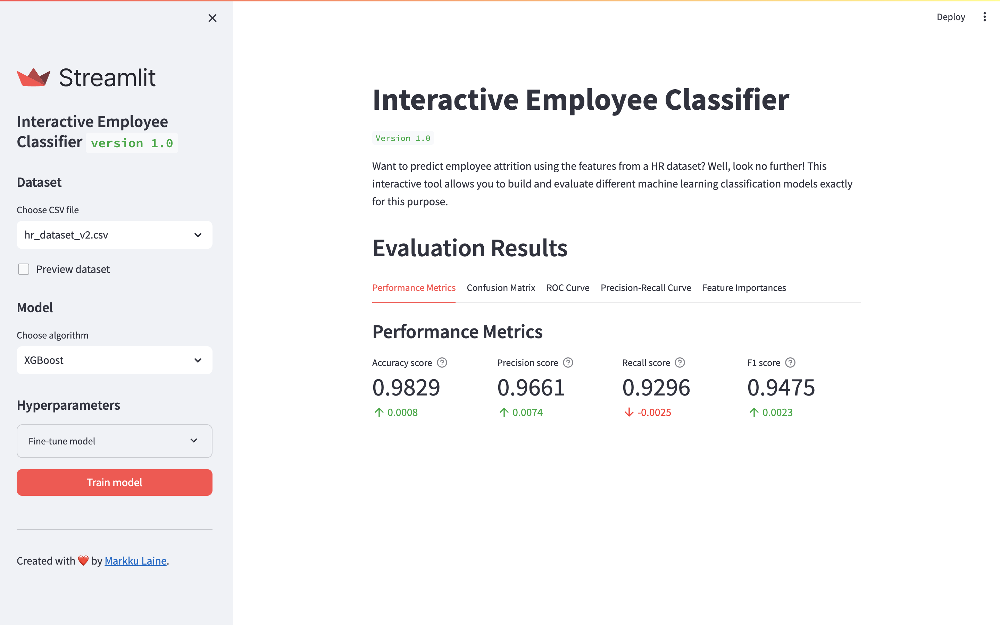

# Interactive Employee Classifier

Want to predict employee attrition using the features from a HR dataset? Well, look no further! This interactive tool allows you to build and evaluate different machine learning classification models exactly for this purpose.

**Live app:** <https://interactive-employee-classifier.streamlit.app><br>
**Demo video:** <https://youtu.be/UPSQSVIewec>


## Dataset

This project uses preprocessed versions of an [HR dataset](https://www.kaggle.com/datasets/mfaisalqureshi/hr-analytics-and-job-prediction) from Kaggle. The original dataset contains 14,999 rows and 10 columns, each row representing self-reported information from employees.


## Quick Start Guide

### Prerequisites

* [Docker](https://docs.docker.com/)

### Start application

To build and start the services (i.e., Streamlit application), run:

```bash
docker compose up
```

> **Note:** The build process may take several minutes due to the large amount of Python dependencies.

Upon completion, you can start using the Streamlit application by opening your web browser and navigating to <http://localhost:8501>.

### Stop application

To stop and remove the services, just hit `Ctrl+C` and run:

```bash
docker compose down
```


## License

Copyright (c) 2024 [Markku Laine](https://markkulaine.com)

This software is distributed under the terms of the [MIT License](https://opensource.org/license/mit/). See [LICENSE](./LICENSE) for details.
